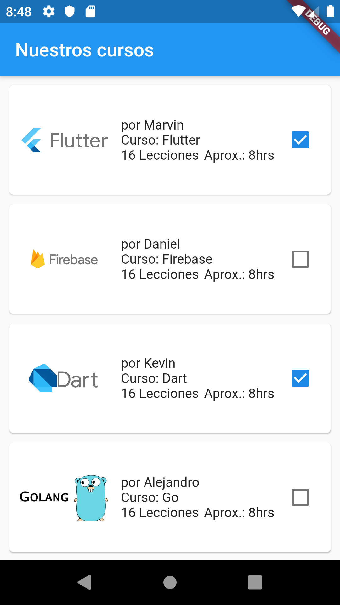
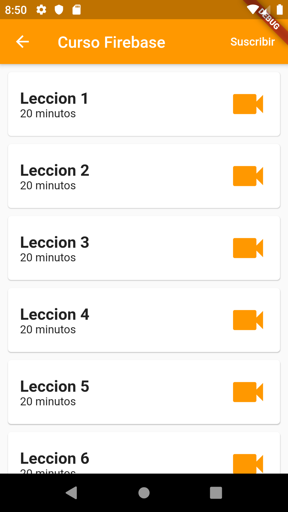

# Academy courses

An app that display the list of courses of the academy and its lessons.

## Constructed with 🛠️

- [Flutter](https://flutter.dev) - used Framework

## Author ✒️

- **Eduardo Coto** - creator of proyect.

## License 📄

 This project is under the License(MIT)

